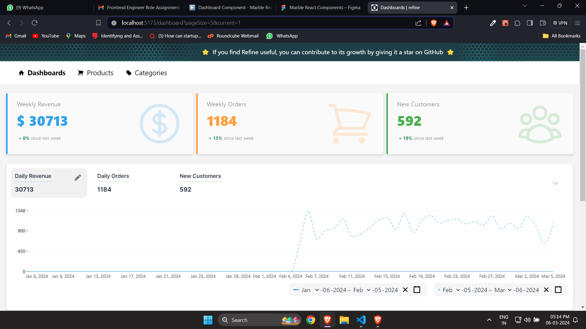
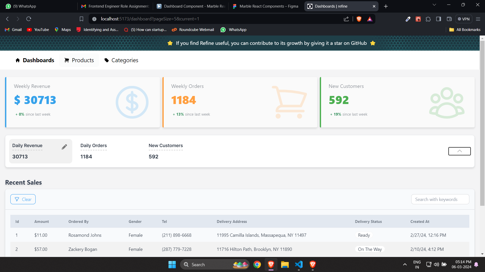
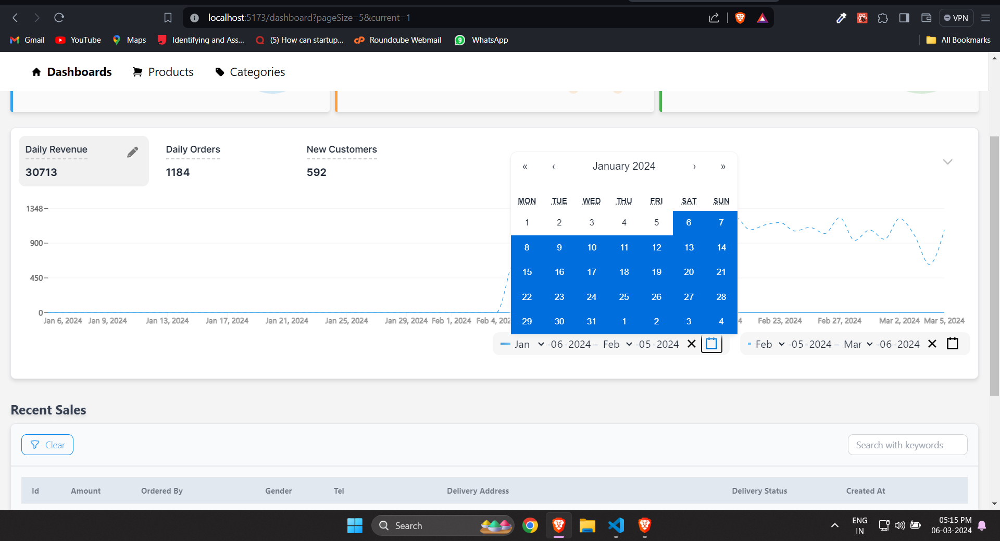
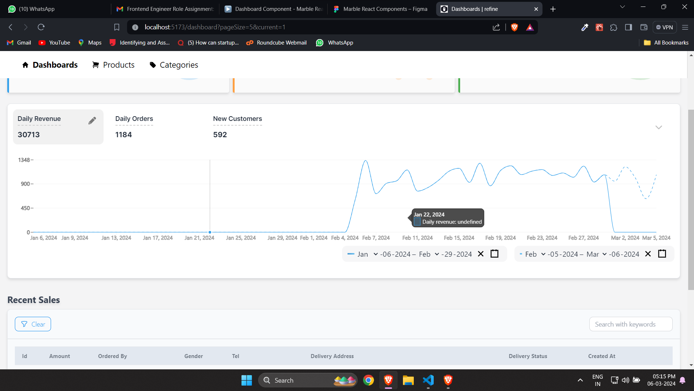

#Approach

- Analazyed the existing code base.
- Understood the requirements properly.
- The changes are done in the following files
  - src/pages/Dashboard.tsx
  - src/components/dashboard/TabView.tsx
  - src/components/dashboard/ResponsiveLineChart.tsx
- Added @wojtekmaj/react-daterange-picker from npm for implementing date ranges

---

#Assumptions

- I took the existing data for this task, the percentage values are not present in existing data from api, If the data have a percentage value, it can also displayed in the UI, like the TOTAL

- Initally the first date range will be 1 month back of current date - current date
  - Example 01 JAN 2024 - 01 FEB 2024 ( current date )

#Screenshots

